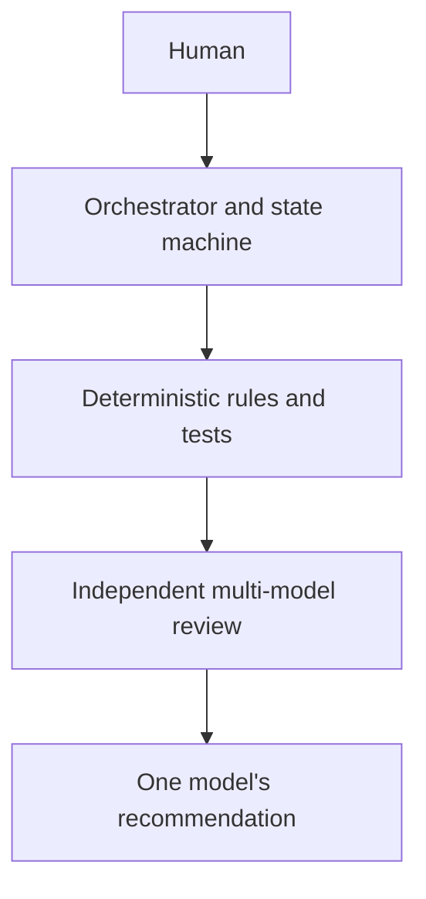
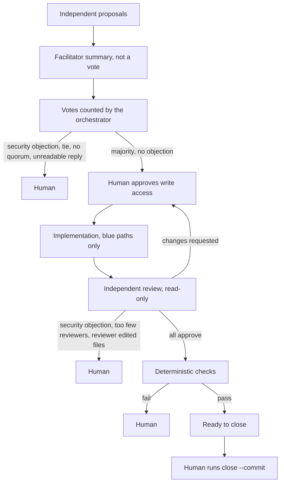

# Blue-team orchestration architecture

Three coding agents build the blue team on the `Mayo` branch: Claude, Codex, and Antigravity. A deterministic Python program, the orchestrator, coordinates them. This document explains who controls what and why.

## Authority



No layer can override a layer above it. Multi-model consensus is advisory. The models can share blind spots, and text in a thread can steer them. The stronger controls are the human, the state machine, sandboxed CLI modes, before-and-after snapshots of every run, git hooks, and the deterministic test suite.

## Task flow



The state machine in `bin/state.py` records each task as one of these phases: `new`, `proposing`, `proposed`, `voting`, `accepted`, `implementing`, `implemented`, `reviewing`, `approved`, `changes_requested`, `ready_to_close`, `closed`, and `needs_human`. Only the transitions listed in `TRANSITIONS` are allowed. Each one is appended to the task's `history`.

## Why command-line clients

The models run through their own CLIs (`claude`, `codex`, `agy`) rather than through APIs. Three reasons:
- Each CLI already has the agent loop: it reads files, edits code, and runs tests.
- Each CLI has its own permission and sandbox modes, which the orchestrator selects per run.
- Your existing sign-ins are reused, so no API keys pass through the framework.

The adapters in `bin/adapters.py` hide each vendor's differences:

| Model | Read-only run | Write run | Reply arrives in |
| --- | --- | --- | --- |
| Claude | `-p`, `--permission-mode dontAsk`, read tools only | `--permission-mode acceptEdits`, git write commands denied | JSON envelope on stdout |
| Codex | `exec --sandbox read-only` | `exec --sandbox workspace-write` | `--output-last-message` file, shaped by `--output-schema` |
| Antigravity | `--mode plan --sandbox` | `--mode accept-edits --sandbox` | JSON envelope on stdout, shaped by `--json-schema` |

Every flag comes from `config.json` and was checked against the installed version's `--help`. When a CLI changes, edit the config, not the code. The prompt always travels in a file and the command line carries one plain sentence, because Windows passes the npm `.cmd` launchers' arguments through `cmd.exe`, which can mangle quotes and braces.

## What each party controls

| Party | Controls | Cannot |
| --- | --- | --- |
| Human | Approving write access, resolving escalations, closing (committing), pushing, editing the config and rules | — |
| Orchestrator | Workflow state, vote and review counting, implementer selection, which CLI mode each run gets, snapshots, running checks, committing when the human closes | Approve its own escalations, push |
| Models | The content of proposals, summaries, votes, implementation, and reviews | Change state, commit, push, switch branches, review their own work, write outside the blue paths |

## Shared memory

Everything lives in files on the branch, so every model and teammate sees the same history.

| Path | Holds | Who writes |
| --- | --- | --- |
| `state/B-NN.json` | Phase, recorded proposals, votes, reviews, approvals, checks, append-only history | Orchestrator |
| `decisions/NNNN-*.md` | Every participant's position, the counting rule, implementer selection, objections | Orchestrator or human, never changed once committed |
| `comms/threads/*.md` | Readable record of every reply, with run ID and reply hash | Orchestrator, plus interactive posts through `board.py` |
| `comms/threads/handoffs.md` | Requests for other team members | Anyone, through `board.py` |
| `tasks.json`, `CHECKLIST.md` | Task board | `board.py` only |
| `roles/`, `prompts/`, `schemas/` | Role cards, phase instructions, reply formats | Human |
| `runs/` | Prompts and raw CLI output (local only, not committed) | Orchestrator |

Threads are append-only, committed decisions never change, and state history only grows. The pre-commit hook enforces all three, and `guard.py verify` checks them at any time.

## Decisions and security objections

1. Every available model proposes independently, from the same snapshot. Posts appear only after all proposals are in.
2. The facilitator summarizes. Its summary is labeled as not a vote.
3. Every available model, the facilitator included, votes `agree`, `object`, `security-objection`, or `abstain`, as schema-checked JSON.
4. `state.evaluate_votes` decides. Acceptance needs a majority of the votes cast, at least `quorum` votes, no unreadable reply, and no security objection. Anything else goes to the human.

A security objection records the model, its reason, and the task. It always stops the task, and a majority never overrides it. The human can override it with `resolve B-NN accept --note "..."`, which writes a new decision record saying so.

## Review

Reviewers are every available model except the implementer, with at least `policy.min_reviewers` (2) of them. Unavailable or failing reviewers are recorded and never counted. Reviewers run read-only. If one changes a file, the snapshot catches it and the task stops. Changes requested send the task back for a new human approval. Approved reviews trigger the check suite, and only passing checks reach `ready_to_close`.

## Write boundaries and git protections

Commit hooks can stop a bad commit, but not a file change on disk. So every model run is bracketed by snapshots (`bin/watch.py`) that record:
- the branch and HEAD,
- every ref,
- the git config,
- `core.hooksPath`, and
- the content hash of every modified, untracked, and ignored file.

After the run, the orchestrator stops the task if it finds any of these:
- a branch switch,
- a new commit or reset,
- a ref change,
- a git config change,
- a file change during a read-only run,
- a write outside `model_write_paths`, or
- a write to `protected_paths` or `blue-team/`.

The defense layers:
1. Rules in `AGENTS.md` and in every prompt.
2. The orchestrator: decision gate, human gate, and single-use approvals.
3. CLI sandbox and permission modes.
4. Run snapshots.
5. Git hooks: commits only on `Mayo` and in the blue paths, append-only records, and pushes only to `Mayo`, never forced or deleted.
6. The test suite.

**Known limits.** Writes outside the repository cannot be detected, so those depend on each CLI's sandbox. Client-side hooks can be bypassed with `--no-verify` or by unsetting `core.hooksPath`. Server-side branch protection on GitHub is the stronger control, and only the repository owner can set it.

## Operating it

```sh
python blue-team/bin/guard.py install                    # once per clone
python blue-team/bin/orchestrate.py doctor               # status of tools, git, hooks, files, config
python blue-team/bin/orchestrate.py doctor --live        # plus one real read-only call per model
python blue-team/bin/orchestrate.py auto B-06 --dry-run  # the plan, with no model calls and no writes
python blue-team/bin/orchestrate.py auto B-06            # runs until a human step
python blue-team/bin/orchestrate.py approve B-06         # grant write access for one attempt
python blue-team/bin/orchestrate.py close B-06 --commit  # commit a ready task; push yourself
```

`doctor` labels each check READY, WARNING, NOT INSTALLED, or MISCONFIGURED, and never prints tokens. The steps can also run one at a time: `plan`, `decide`, `approve`, `implement`, `review`, `check`, `close`.

## Recovering from a failed run

1. `python blue-team/bin/orchestrate.py escalations` shows stopped tasks and why. `state B-NN` shows recent history.
2. Read the task thread and the raw output in `blue-team/runs/<run-id>/`.
3. If a model changed files it should not have, inspect them with `git status` and `git diff`, and revert them yourself. The orchestrator never reverts anything.
4. If a CLI failed, run `doctor`. Sign in again or fix its command in `config.json`.
5. Resolve with `--note` explaining why:
   - `retry` re-runs the failed step. A write step needs a new `approve`.
   - `reopen` starts the task over, archiving the old round.
   - `accept` approves a decision that stopped at the vote, and is recorded as a human override.
   - `revise` sends a task that stopped during review (for example on a valid security objection) back to the implementer. The reviews go into the revision prompt, and a new `approve` is needed.
6. If a run was interrupted, the next command detects it and stops the task with `interrupted-run`. Check the working tree, then resolve.
